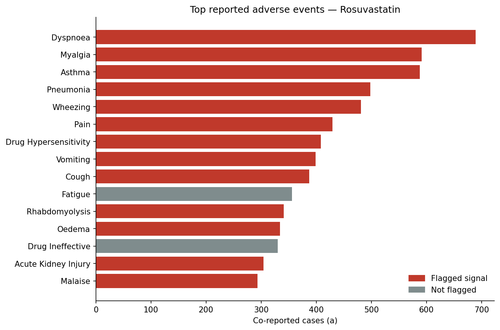

# Drug Safety Signal Analysis (FDA FAERS)

Detecting potential adverse-drug-reaction **safety signals** from real-world
spontaneous reports, using the same disproportionality methods (PRR and ROR)
that pharmacovigilance teams rely on in practice.

> **TL;DR** — I load and clean the FDA's public adverse-event reports, compute
> PRR/ROR disproportionality statistics for a chosen drug class, flag potential
> signals against the standard Evans (2001) criteria, and write a short
> plain-language safety memo interpreting one signal for non-technical
> stakeholders.



*(Run the pipeline to regenerate this chart for your chosen drug class.)*

---

## Problem

Once a drug is on the market, rare or delayed adverse events show up in
spontaneous report databases long before they appear in controlled trials.
The challenge is separating a real safety signal from background noise:
a common event will be reported a lot for *every* drug. **Disproportionality
analysis** asks a sharper question — *is this event reported more often for
this drug than we'd expect given how often it's reported for all other drugs?*

## Data

- **Source:** [FDA Adverse Event Reporting System (FAERS)](https://www.fda.gov/drugs/fda-adverse-event-monitoring-system-aems/fda-adverse-event-monitoring-system-aems-latest-quarterly-data-files) — public, downloadable quarterly extracts of real-world adverse-event reports.
- **Tables used:** `DEMO` (one row per report), `DRUG` (drugs per report, with suspect-vs-concomitant role codes), `REAC` (MedDRA preferred-term reactions).
- **Scale:** each quarter is hundreds of thousands of reports; the pipeline concatenates several quarters and de-duplicates to one row per case.
- **No credentialing required** — the quarterly files are fully open.

## Approach

1. **Download & unzip** the configured quarters straight from the FDA (`src/download_faers.py`).
2. **Load & clean** the `$`-delimited ASCII tables, normalise columns, and de-duplicate cases by keeping the latest version per `caseid` (`src/load_faers.py`).
3. **Restrict to suspect drugs** (FAERS role codes `PS`/`SS`) so incidental concomitant medications don't inflate counts.
4. **Build a 2×2 contingency table** for every adverse event reported with the target drug and compute:
   - **PRR** (Proportional Reporting Ratio) with 95% CI
   - **ROR** (Reporting Odds Ratio) with 95% CI
   - **Chi-squared** with Yates' correction
5. **Flag signals** using the Evans (2001) criteria: `PRR ≥ 2`, `chi² ≥ 4`, and `≥ 3` co-reported cases.
6. **Communicate** — rank the results, plot them, and write a one-page RWE memo (`reports/rwe_memo.md`) interpreting one signal in plain language.

## Results
Muscle-related events dominated the disproportionality signals for rosuvastatin: myalgia (591 reports, PRR 16), rhabdomyolysis (341 reports, PRR 48), myopathy (PRR 52), and raised creatine phosphokinase (PRR 27) were all flagged. This pattern is consistent with rosuvastatin's well-established statin-class muscle toxicity, and the fact that these known signals surfaced strongly serves as a validation that the method is working as intended. Hepatic signals (raised ALT, hepatic enzymes) were also flagged, consistent with the drug's label.

Running `python run_analysis.py` produces:

- `data/processed/signals.csv` — every adverse-event term ranked by PRR, with CIs, chi², and a signal flag.
- `figures/top_adverse_events.png` — most-reported events, signals highlighted.
- `figures/signal_scatter.png` — PRR vs. case count, with the PRR ≥ 2 threshold drawn in.

> Fill in 2–3 sentences here with your actual headline finding once you've run
> it on your chosen drug class — e.g. which event came out as the strongest
> disproportionality signal and how it compares to the drug's known label.

## Run it yourself

```bash
pip install -r requirements.txt

# 1. Choose your drug class and quarters in src/config.py
# 2. Download the FAERS quarters
python -m src.download_faers

# 3. Run the full analysis
python run_analysis.py
```

Or step through the narrative version in
[`notebooks/01_faers_signal_analysis.ipynb`](notebooks/01_faers_signal_analysis.ipynb).

## Project structure

```
faers-drug-safety-signals/
├── README.md
├── requirements.txt
├── run_analysis.py            # end-to-end pipeline
├── src/
│   ├── config.py              # drug class, quarters, thresholds — edit here
│   ├── download_faers.py      # fetch + unzip FAERS quarters from the FDA
│   ├── load_faers.py          # load, clean, de-duplicate; build report-event table
│   ├── disproportionality.py  # PRR, ROR, chi², CIs, signal flags
│   └── visualize.py           # README figures
├── notebooks/
│   └── 01_faers_signal_analysis.ipynb
├── reports/
│   └── rwe_memo.md            # plain-language interpretation of one signal
└── data/                      # raw downloads are git-ignored
```

## Methods & caveats

Disproportionality measures flag **statistical** signals, not confirmed causal
relationships. FAERS is a spontaneous-reporting system with well-known
limitations: under-reporting, reporting biases, no exposure denominator, and
duplicate reports. A flagged signal is a *hypothesis to investigate*, not a
conclusion — which is exactly how pharmacovigilance teams treat it.

**Reference:** Evans SJW, Waller PC, Davis S. *Use of proportional reporting
ratios (PRRs) for signal generation from spontaneous adverse drug reaction
reports.* Pharmacoepidemiol Drug Saf. 2001;10(6):483–486.
